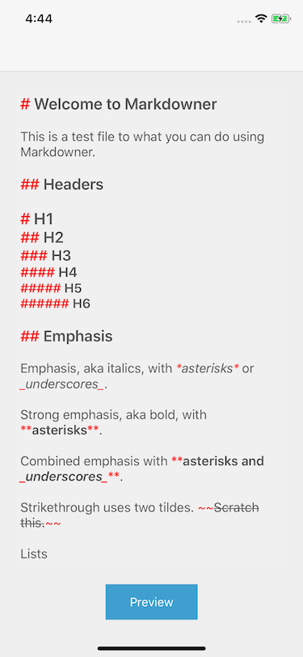

# Markdowner

[](https://cocoapods.org/pods/Markdowner)
[](https://cocoapods.org/pods/Markdowner)
[](https://cocoapods.org/pods/Markdowner)

`Markdowner` is a library intended to edit and preview markdown in real time. It supports custom markdown elements or use only a subset of the standard ones. Custom fonts and colors are also supported.  



## Example

To run the example project, clone the repo, and run `pod install` from the Example directory first.

## Requirements
Requires iOS 10 or later and Swift 4.1 or later.

## Installation

Markdowner is available through [CocoaPods](https://cocoapods.org). To install
it, simply add the following line to your Podfile:

```ruby
pod 'Markdowner'
```

## How to use it
The main entry point ot use `Markdowner` is using the custom type  `MarkdownTextView`, which is just a sublcass of `UITextView`.

```swift
var textView = MarkdownTextView(frame: parentView.bounds)
parentView.addSubview(textView)
textView.frame = ... // setup text view position inside its parent
textView.text = ... // set the initial markdown to display, if any

```

If you want to customize the default look of the markdown elements, you can use the class `MarkdownElementsConfig`.

```swift
textView.elementsConfig = MarkdownElementsConfig().overriding(
    style: StylesConfiguration(
        baseFont: UIFont.systemFont(ofSize: 18),
        textColor: UIColor.darkGray,
        symbolsColor: UIColor.red,
        useDynamicType: true
    )
)
```

You can also choose which standard markdown elements are available and how they will work. The following example recognizes headers from level 1 to 3, and disable links:

```swift
self.textView.elementsConfig = MarkdownElementsConfig().overriding(
    headerConfig: .enabled(maxLevel: .h3),
    linkConfig: .disabled
)
```

Creating custom elements is as simple as subclassing the type `MarkdownElement`, and then provide instances of those custom elements via the same `overriding` function:

```swift
self.textView.elementsConfig = MarkdownElementsConfig().overriding(
    customElements: [CustomElement1(), CustomElement2()]
)
```

As a guide for creating new elements, you could use any of the already implemented ones inside the folder `Markdowner/Classes/Default Elements`.

> NOTE: `Markdowner` doesn't support initialization from Storyboards currently.

## Author

rlaguilar, rlac1990@gmail.com

## License

Markdowner is available under the MIT license. See the LICENSE file for more info.
